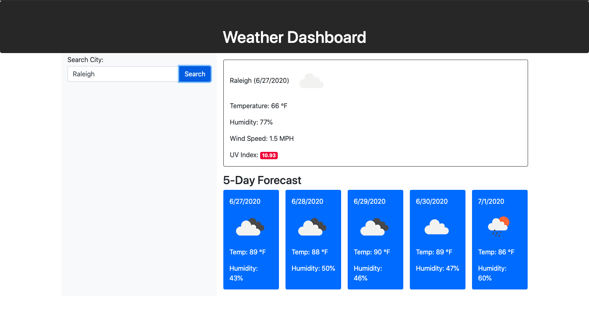

# weather-dashboard

Project Title: Weather Dashboard

Purpose: The purpose of this project was to create a weather aplication that will give you the forecast any city for the following five days.

Content:

- The html for this page organizes the page with columns and sections through bootstrap. The search bar has its own column on the left and the results take up majority of the page on the right.

- Javascript is used to create and call the function that utilizes the api to display the weather forecast

- All functions are located in the script.js files

- This website uses the Open Weather Api in order to grab the information displayed on the webpage .

Screenshot of working application:

Links to webpage and source code are available below:

https://iariyami.github.io/weather-dashboard/

https://github.com/iariyami/weather-dashboard
